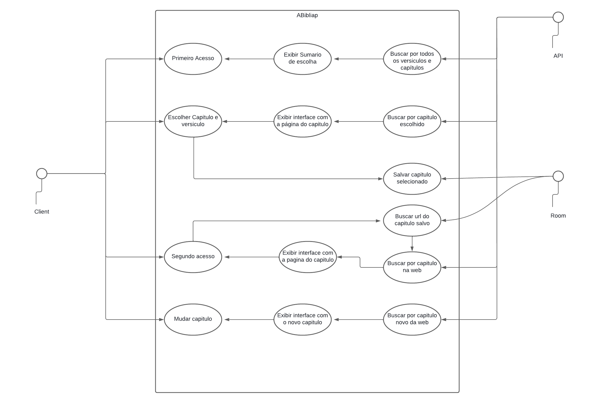

<h1 align="center">ABíbliap 📖</h1>

##

    

##

> 📃 Este é um aplicativo de Bíblia online que permite aos usuários ler o conteúdo da Bíblia a partir de seu dispositivo móvel.

## ⚙️ Funcionalidades

- **Leitura da Bíblia**: Permite aos usuários ler a Bíblia em diferentes versões e idiomas.

## 💻 Requisitos do sistema

O aplicativo é compatível com dispositivos Android 12 ou superior.

## 🔧 Suporte

Se você tiver problemas ou dúvidas sobre o aplicativo, entre em contato com nossa equipe de suporte.

## 🤝 Contribuidores

<table>
  <tr>
    <td align="center">
      <a href="https://github.com/Faguim02" title="Fagner Muniz de Sá">
         
        
          <b>Fagner Muniz de Sá</b>
        
      </a>
    </td>
  </tr>
</table>

## 🧠 Caso de uso

